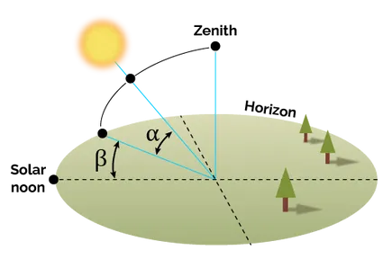
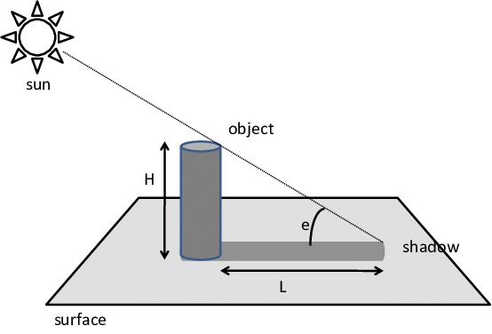
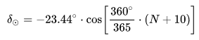
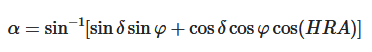
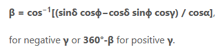
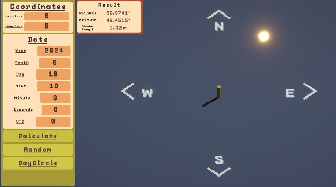
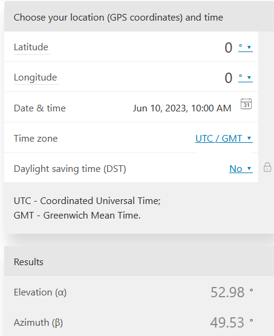
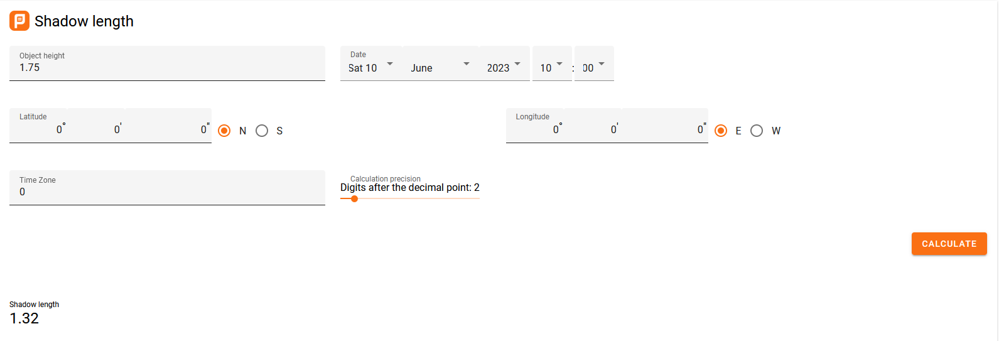

# TheSun
 This program involves taking user input and implementing the position of the sun based on the user's current location, date, and time.
## The Features
1. Input Latitude, Longitude, Date then Press [Calcualte](#) to get the output data.
2. Press [Random](#) to generate and calculate a random Sun Data.
3. Press [Day Cicle](#) to simulate the Sun's position from 0am to 11pm in the same input date. 


## The Installation
To download the program, access [itch](https://penwyn.itch.io/the-sun), scroll down and find the Download Now button. Then, download the program files, extract, and run the program.

## The Input And Output
### The Input
    Lattitude, Longitude.
    Valid DateTime.
    Time Zone Different From UTC.
### The Output
1. **Sun Elevation Angle (α)**: Measures the Sun's height relative to the horizon line. For example, if the Sun is at zenith, this Angle will be 90 degrees.



2. **Azimuth Angle(β)**: Tells you how much you should turn clockwise to look directly at the Sun.
3. **Shadow Length**: L = ObjectLength / tan(α).


## The Calculations
Please check **SunData.cs** if you want to see the full code, calculations.

First of all we need to calculate the **Declination** of the sun using **DateSinceYearStart(N)**.



Second, we need to get the Hour Angle(HRA). It is calculated using [This Guide](https://www.pveducation.org/pvcdrom/properties-of-sunlight/solar-time#HRA)


Next, calculate the **Sun's Elevation Angle** using **Latitude**, **Declination** and **HRA**.



Next, calculate **Azimuth Angle** using **Declination**, **Latitude** and **HRA**.



The final output is **Shadow Length**.
```C#
public float GetShadowLength()
{
    return Mathf.Max(0, ObjectHeight / Mathf.Tan(SunElevationAngle * Mathf.Deg2Rad));
}
```

Finally, when the user press the [Calcualte](#) button, the program calls the calculation and visualization functions in the **SunSimulator.cs** script.
```C#
    ...
    if (AllInputFieldsArePresent())
    {
        if (IsInputDateValid() && IsCoordinateValid())
        {
            GetInputDataFromUI();
            CalculateSunData();
        }
    }
    ...
```
## The Visualization
After getting all of the output from calculations, the sun object will be moved to a simulated position and it's transform.forward will be set to the direction to the human object (pillar).
```C#
public void SimulateSunPosition()
{
       Vector3 sunPos = Quaternion.AngleAxis(SunData.SunElevationAngle, Vector3.forward) * Vector3.right * SunObjectDistance;
       Vector2 positionOnPlane = new Vector2(Mathf.Sin(SunData.AzimuthAngle * Mathf.Deg2Rad), Mathf.Cos(SunData.AzimuthAngle * Mathf.Deg2Rad)).normalized * SunObjectDistance;
       sunPos.x = ObserverObject.transform.position.x + positionOnPlane.x;
       sunPos.z = ObserverObject.transform.position.z + positionOnPlane.y;

       this.transform.position = sunPos;
       this.transform.forward = (GameObject.FindGameObjectWithTag("Player").transform.position - this.transform.position);
}
```
## The Accuracy
I use [Omni](https://www.omnicalculator.com/physics/sun-angle) to check the output of my calculations.
The results should not vary too much.
And this [Calculator](https://planetcalc.com/1875/) is for checking the Shadow Length accuracy.

Although sometimes, the azimuth angle will be (360 - Actual Value) due to the HRA getting a negative number unintentionally.

# The Example



# The References
[Local Hour Angle](https://www.pveducation.org/pvcdrom/properties-of-sunlight/solar-time#HRA)

[Elevation Angle](https://www.pveducation.org/pvcdrom/properties-of-sunlight/elevation-angle)

[Position of the Sun](https://en.wikipedia.org/wiki/Position_of_the_Sun)

# The Notes
Thank you for reading through this project.

Please leave me any note to improve in the Issues section or Comment on [itch.io](itch.io).
